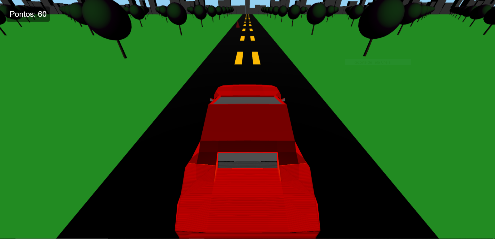

# 🏎️ Jogo 3D com WebGL e Three.js

Este é um jogo 3D simples desenvolvido com [Three.js](https://threejs.org/), que simula um carro dirigindo por uma estrada com obstáculos (cones), árvores, prédios e um sistema de pontuação em tempo real.

 <!-- Substitua pelo caminho correto da imagem no seu repositório -->


---

## 🎮 Funcionalidades

* **Carro 3D importado via GLTF**: Um modelo de carro detalhado é carregado no cenário.
* **Sistema de obstáculos com cones**: Cones surgem aleatoriamente na pista como obstáculos.
* **Colisão com mensagem de "Fim de Jogo"**: O jogo detecta colisões e exibe uma tela de game over.
* **Pontuação contínua enquanto o jogador não colide**: Acumule pontos por cada cone evitado.
* **Câmeras alternáveis**: Troque entre diferentes perspectivas de câmera (teclas **1**, **2** e **3**).
* **Cenário imersivo**: Pista com faixas, grama, árvores e prédios compondo o ambiente.
* **Sombras realistas e iluminação direcional**: Gráficos aprimorados com efeitos de luz e sombra.
* **Movimento do carro**: Controle o carro para a esquerda e direita com as teclas **A** e **D**.

---

## 🧰 Tecnologias utilizadas

* [Three.js](https://threejs.org/) (WebGL)
* HTML5 e JavaScript moderno (ES Modules)
* `GLTFLoader` (para carregar o modelo 3D do carro)

---

## 🚀 Como executar localmente

1.  **Clone o repositório**:
    ```bash
    git clone https://github.com/R1chardJr/projetoComputacaoGrafica.git
    cd projetoComputacaoGrafica
    ```
2.  **Instale as dependências**:
    ```bash
    npm install
    ```
3.  **Inicie o servidor local**:
    ```bash
    npm run dev
    ```
4.  **Acesse no navegador**:
    Abra seu navegador e acesse o link fornecido no terminal .

---

## 🎮 Controles

| Tecla | Ação                                |
| :---- | :---------------------------------- |
| **A** | Mover carro para a esquerda         |
| **D** | Mover carro para a direita          |
| **1** | Alternar para câmera traseira       |
| **2** | Alternar para câmera aérea lateral  |
| **3** | Alternar para câmera próxima frontal |

---

## 📁 Estrutura de Arquivos

```bash
/
├── public/                 # Pasta para arquivos estáticos (como modelos 3D)
│   └── carro.glb           # Modelo 3D do carro
├── index.html              # HTML principal com shaders e canvas
├── main.js                 # Lógica do jogo em Three.js
├── package.json            # Configuração de dependências
└── ...                     # Outros arquivos do projeto (p. ex., node_modules)
```

---
 
📝 Licença
Este projeto é de código aberto e pode ser utilizado livremente para fins educacionais.

---
<div align="center"> Desenvolvido com ❤️ usando Three.js </div> 
